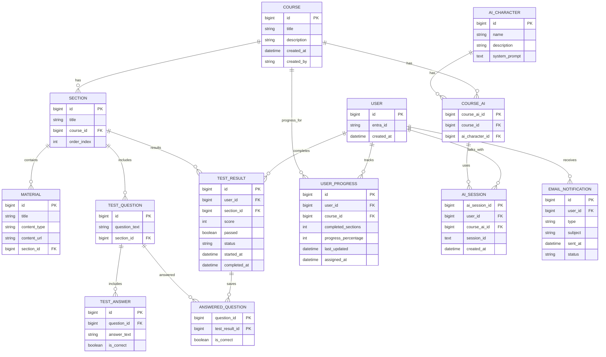

```mermaid
erDiagram

    USER {
        bigint id PK
        string entra_id
        datetime created_at
    }

    COURSE {
        bigint id PK
        string title
        string description
        datetime created_at
        string created_by
    }

    SECTION {
        bigint id PK
        string title
        bigint course_id FK
        int order_index
    }

    MATERIAL {
        bigint id PK
        string title
        string content_type
        string content_url
        bigint section_id FK
    }

    TEST_QUESTION {
        bigint id PK
        string question_text
        bigint section_id FK
    }
    
    TEST_ANSWER {
        bigint id PK
        bigint question_id FK
        string answer_text
        boolean is_correct
    }

    TEST_RESULT {
        bigint id PK
        bigint user_id FK
        bigint section_id FK
        int score
        boolean passed
        string status
        datetime started_at
        datetime completed_at
    }
    
    ANSWERED_QUESTION {
        bigint question_id PK
        bigint test_result_id PK
        boolean is_correct
    }

    USER_PROGRESS {
        bigint id PK
        bigint user_id FK
        bigint course_id FK
        int completed_sections
        int progress_percentage
        datetime last_updated
        datetime assigned_at
    }

    COURSE_AI {
        bigint course_ai_id PK
        bigint course_id FK
        bigint ai_character_id FK
    }
    
    AI_SESSION {
        bigint ai_session_id PK
        bigint user_id FK
        bigint course_ai_id FK
        text session_id
        datetime created_at
    }

    AI_CHARACTER {
        bigint id PK
        string name
        string description
        text system_prompt
    }

    EMAIL_NOTIFICATION {
        bigint id PK
        bigint user_id FK
        string type
        string subject
        datetime sent_at
        string status
    }

    USER ||--o{ USER_PROGRESS : tracks
    COURSE ||--o{ USER_PROGRESS : progress_for
    
    COURSE ||--o{ SECTION : has
    SECTION ||--o{ MATERIAL : contains
    SECTION ||--o{ TEST_QUESTION : includes
    TEST_QUESTION ||--o{ TEST_ANSWER : includes

    USER ||--o{ TEST_RESULT : completes
    SECTION ||--o{ TEST_RESULT : results

    TEST_RESULT ||--o{ ANSWERED_QUESTION : saves
    TEST_QUESTION ||--o{ ANSWERED_QUESTION : answered

    COURSE ||--o{ COURSE_AI : has
    AI_CHARACTER ||--o{ COURSE_AI : has
    
    USER ||--o{ AI_SESSION : talks_with
    COURSE_AI ||--o{ AI_SESSION : uses

    USER ||--o{ EMAIL_NOTIFICATION : receives

```