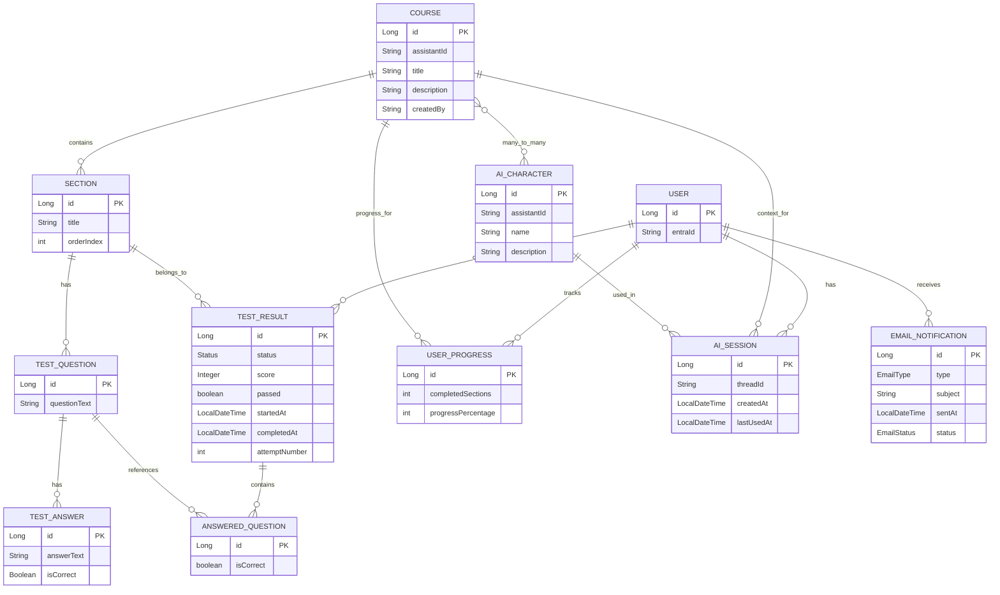

```mermaid
erDiagram

    USER {
        Long id PK
        String entraId
    }

    COURSE {
        Long id PK
        String assistantId
        String title
        String description
        String createdBy
    }

    SECTION {
        Long id PK
        String title
        int orderIndex
    }

    TEST_QUESTION {
        Long id PK
        String questionText
    }

    TEST_ANSWER {
        Long id PK
        String answerText
        Boolean isCorrect
    }

    TEST_RESULT {
        Long id PK
        Status status
        Integer score
        boolean passed
        LocalDateTime startedAt
        LocalDateTime completedAt
        int attemptNumber
    }

    ANSWERED_QUESTION {
        Long id PK
        boolean isCorrect
    }

    USER_PROGRESS {
        Long id PK
        int completedSections
        int progressPercentage
    }

    AI_CHARACTER {
        Long id PK
        String assistantId
        String name
        String description
    }

    AI_SESSION {
        Long id PK
        String threadId
        LocalDateTime createdAt
        LocalDateTime lastUsedAt
    }

    EMAIL_NOTIFICATION {
        Long id PK
        EmailType type
        String subject
        LocalDateTime sentAt
        EmailStatus status
    }

%% RELATIONSHIPS

    COURSE ||--o{ SECTION : contains
    SECTION ||--o{ TEST_QUESTION : has
    TEST_QUESTION ||--o{ TEST_ANSWER : has

    USER ||--o{ TEST_RESULT : owns
    SECTION ||--o{ TEST_RESULT : belongs_to

    TEST_RESULT ||--o{ ANSWERED_QUESTION : contains
    TEST_QUESTION ||--o{ ANSWERED_QUESTION : references

    USER ||--o{ USER_PROGRESS : tracks
    COURSE ||--o{ USER_PROGRESS : progress_for

    USER ||--o{ AI_SESSION : has
    COURSE ||--o{ AI_SESSION : context_for
    AI_CHARACTER ||--o{ AI_SESSION : used_in

    COURSE }o--o{ AI_CHARACTER : many_to_many

    USER ||--o{ EMAIL_NOTIFICATION : receives

```