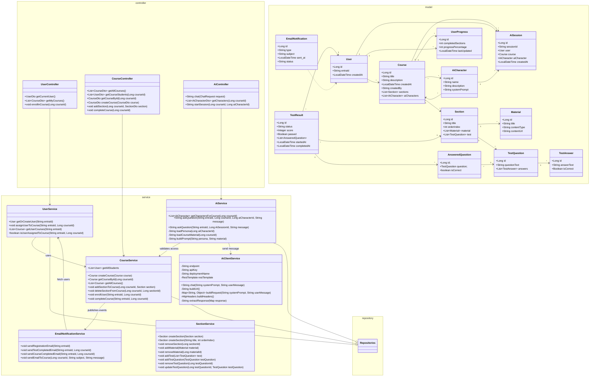

```mermaid
classDiagram

    Course "1" --> "*" Section
    Course "*" --> "*" AiCharacter
    Course "1" --> "*" UserProgress
    Course "1" --> "*" AiSession

    Section "1" --> "*" Material
    Section "1" --> "*" TestQuestion

    User "1" --> "*" UserProgress
    User "1" --> "*" AiSession
    User "*" --> "*" Course

    TestQuestion "1" --> "*" TestAnswer

    TestResult "1" --> "*" AnsweredQuestion
    TestResult "*" --> "1" User
    TestResult "*" --> "1" Section

    AnsweredQuestion "*" --> "1" TestQuestion

    AiCharacter "*" --> "*" Course
    AiCharacter "1" --> "*" AiSession

    EmailNotification ..> User


    UserService --> CourseService : uses
    CourseService --> EmailNotificationService : publishes events
    AiService --> CourseService : validates access
    EmailNotificationService --> UserService : fetch users
    AiService --> AiClientService : send message
    CourseService --o Repositories
    UserService --o Repositories
    AiService --o Repositories


    UserController --> UserService
    CourseController --> CourseService
    AiController --> AiService

    
    namespace service {
        class UserService {
            +User getOrCreateUser(String entraId)
            +void assignUserToCourse(String entraId, Long courseId)
            +List~Course~ getUserCourses(String entraId)
            +boolean isUserAssignedToCourse(String entraId, Long courseId)
        }
        class CourseService {
            +Course createCourse(Course course)
            +Course getCourseById(Long courseId)
            +List~Course~ getAllCourses()
            +void addSectionToCourse(Long courseId, Section section)
            +void deleteSectionFromCourse(Long courseId, Long sectionId)
            +void enrollUser(String entraId, Long courseId)
            +void completeCourse(String entraId, Long courseId)
            +List~User~ getAllStudents
        }
        
        class SectionService {
            +Section createSection(Section section)
            +Section createSection(String title, int orderIndex)
            +void removeSection(Long sectionId)
            +void addMaterial(Material material)
            +void removeMaterial(Long materialId)
            +void addTest(List~TestQuestion~ test)
            +void addTestQuestion(TestQuestion testQuestion)
            +void removeTestQuestion(Long testQuestionId)
            +void updateTestQuestion(Long testQuestionId, TestQuestion testQuestion)
        }
        
        class EmailNotificationService{
            +void sendRegistrationEmail(String entraId)
            +void sendTestCompletedEmail(String entraId, Long courseId)
            +void sendCourseCompletedEmail(String entraId, Long courseId)
            +void sendEmailToCourse(Long courseId, String subject, String message)
        }
        class AiService{
            +List~AiCharacter~ getCharactersForCourse(Long courseId)

            +String askQuestion(String entraId, Long courseId, Long aiCharacterId, String message)
            +String askQuestion(String entraId, Long AiSessionId, String message)
            

            -String loadPersona(Long aiCharacterId)

            -String loadCourseMaterial(Long courseId)

            -String buildPrompt(String persona, String material)
        }
        
        class AiClientService {
            -String endpoint
            -String apiKey
            -String deploymentName
            -RestTemplate restTemplate

            +String chat(String systemPrompt, String userMessage)

            -String buildUrl()
            -Map~String, Object~ buildRequest(String systemPrompt, String userMessage)
            -HttpHeaders buildHeaders()
            -String extractResponse(Map response)
        }
    }
    
    namespace repository {
        class Repositories
    }
    
    namespace controller {
        class UserController{
            +UserDto getCurrentUser()
            +List~CourseDto~ getMyCourses()
            +void enrollInCourse(Long courseId)
        }
        class CourseController{
            +List~CourseDto~ getAllCourses()
            +List~UserDto~ getCourseStudents(Long courseId)
            +CourseDto getCourseById(Long courseId)
            +CourseDto createCourse(CourseDto course)
            +void addSection(Long courseId, SectionDto section)
            +void completeCourse(Long courseId)
        }
        class AiController{
            +String chat(ChatRequest request)
            +List~AiCharacterDto~ getCharacters(Long courseId)
            +String startSession(Long courseId, Long aiCharacterId)
        }
    }
    
    namespace model {
        class User {
            +Long id
            +String entraId
            +LocalDateTime createdAt
        }

        class Course {
            +Long id
            +String title
            +String description
            +LocalDateTime createdAt
            +String createdBy
            +List~Section~ sections
            +List~AiCharacter~ aiCharacters
        }

        class Section {
            +Long id
            +String title
            +int orderIndex
            +List~Material~ material
            +List~TestQuestion~ test
        }

        class Material {
            +Long id
            +String title
            +String contentType
            +String contentUrl
        }
        class TestQuestion {
            +Long id
            +String questionText
            +List~TestAnswer~ answers
        }
        class TestAnswer {
            +Long id
            +String answerText
            +Boolean isCorrect
        }
        class TestResult {
            +Long id
            +String status
            +Integer score
            +Boolean passed
            +List~AnsweredQuestion~
            +LocalDateTime startedAt
            +LocalDateTime completedAt
        }
        class AnsweredQuestion {
            +Long id;
            +TestQuestion question;
            +boolean isCorrect
        }
        class UserProgress {
            +Long id
            +int completedSections
            +int progressPercentage
            +LocalDateTime lastUpdated
        }
%%        class CourseAi {
%%        }
        class AiCharacter {
            +Long id
            +String name
            +String description
            +String systemPrompt
        }
        class AiSession {
            +Long id
            +String sessionId
            +User user
            +Course course
            +AiCharacter aiCharacter
            +LocalDateTime createdAt
        }
        class EmailNotification {
            +Long id
            +String type
            +String subject
            +LocalDateTime sent_at
            +String status
        }
    }
    
```