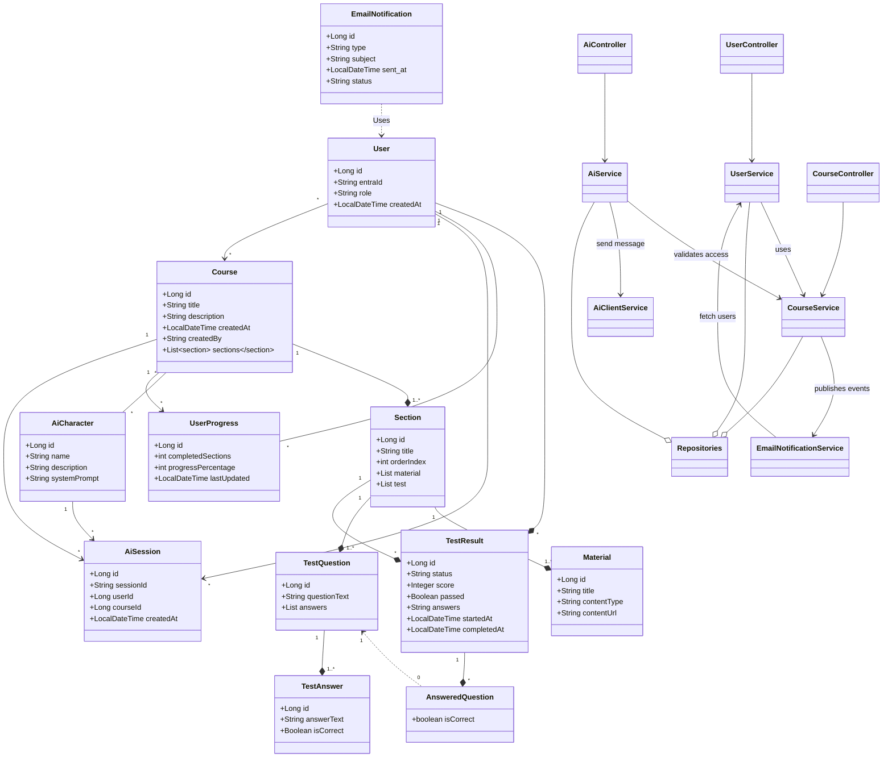

```mermaid
classDiagram
    
    Course "1" --* "1..*" Section
    Course "*" -- "*" AiCharacter
    Course "1" --> "*" UserProgress
    Course "1" --> "*" AiSession
    Section "1" --* "1..*" Material
    Section "1" --* "1..*" TestQuestion
    Section "1" --* "*" TestResult
    User "1" --* "*" TestResult
    User "1" -- "*" UserProgress
    User "1" --> "*" AiSession
    User "*" --> "*" Course
    TestQuestion "1" <.. "0" AnsweredQuestion
    TestQuestion "1" --* "1..*" TestAnswer
    TestResult "1" --* "*" AnsweredQuestion
    AiCharacter "1" --> "*" AiSession
    EmailNotification ..> User : Uses


    UserService --> CourseService : uses
    CourseService --> EmailNotificationService : publishes events
    AiService --> CourseService : validates access
    EmailNotificationService --> UserService : fetch users
    AiService --> AiClientService : send message
%%    AiClientService --> RestTemplate
    CourseService --o Repositories
    UserService --o Repositories
    AiService --o Repositories


    UserController --> UserService
    CourseController --> CourseService
    AiController --> AiService

    
    
    
%%    namespace model {
        class User {
            +Long id
            +String entraId
            +String role
            +LocalDateTime createdAt
        }

        class Course {
            +Long id
            +String title
            +String description
            +LocalDateTime createdAt
            +String createdBy
            +List<Section> sections
        }

        class Section {
            +Long id
            +String title
            +int orderIndex
            +List<Material> material
            +List<TestQuestion> test
        }

        class Material {
            +Long id
            +String title
            +String contentType
            +String contentUrl
        }
        class TestQuestion {
            +Long id
            +String questionText
            +List<TestAnswer> answers
        }
        class TestAnswer {
            +Long id
            +String answerText
            +Boolean isCorrect
        }
        class TestResult {
            +Long id
            +String status
            +Integer score
            +Boolean passed
            +String answers
            +LocalDateTime startedAt
            +LocalDateTime completedAt
        }
        class AnsweredQuestion {
            +boolean isCorrect
        }
        class UserProgress {
            +Long id
            +int completedSections
            +int progressPercentage
            +LocalDateTime lastUpdated
        }
%%        class CourseAi {
%%        }
        class AiCharacter {
            +Long id
            +String name
            +String description
            +String systemPrompt
        }
        class AiSession {
            +Long id
            +String sessionId
            +Long userId
            +Long courseId
            +LocalDateTime createdAt
        }
        class EmailNotification {
            +Long id
            +String type
            +String subject
            +LocalDateTime sent_at
            +String status
        }
%%    }
    
```