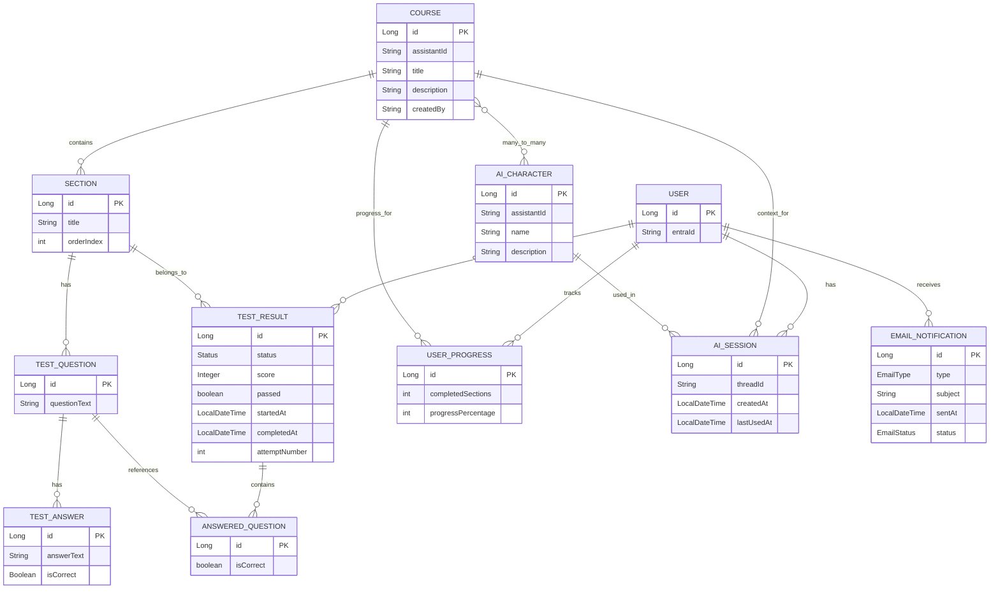

# Teknisk dokumentation

## Projektnamn

**Projekt:** Vinkelboda

**Datum:** 2026-06-10

**Författare:** Erik Thorsell, Alexander Grenander

---

# Innehållsförteckning

1. Introduktion
2. Systemöversikt
3. Arkitektur
4. Teknikstack
5. Projektstruktur
6. Backend
7. Frontend
8. Databas
9. API-dokumentation
10. Säkerhet
11. Installation
12. Konfiguration
13. Testning
14. Deployment
15. Versionshantering
16. Framtida utveckling

---

# 1. Introduktion

## Funktionalitet

#### Systemet erbjuder följande huvudfunktioner:
* Skapa, läsa, uppdatera och ta bort kurser (CRUD)
* Hantera kurssektioner med ordningsindex och låsstatus
* Ladda upp och ladda ner/strömma kursmaterial (PDF, video) via Azure Blob Storage
* Genomföra quiz per sektion och se resultat
* AI-assisterad chatt kopplad till kursmaterial via Azure OpenAI Assistants
* Användarhantering via Microsoft Entra ID (Azure AD)
* Rollbaserad behörighet: Admin, CourseAdmin, Participant
* E-postnotifieringar vid registrering, kursavslut och testresultat

---

# 2. Systemöversikt

## Arkitektur


Systemet följer en klassisk treskiktsarkitektur med React-frontend, Spring Boot-backend och Azure SQL som databas. All kommunikation sker via ett REST API med JWT-autentisering.
```text
+------------------------+
|  Frontend (React/TS)   |  Azure Static Web Apps
|  MSAL — Azure AD auth  |
+----------+-------------+
           |  HTTPS / REST API + Bearer JWT
+----------v-------------+
|  Backend (Spring Boot) |  Azure App Service
|  Java 21 / Maven       |
+----------+-------------+
           |  Spring Data JPA / Hibernate
+----------v-------------+
|  Azure SQL (MS SQL)    |
+------------------------+
```
Sidotjänster:
-  Azure Blob Storage  — PDF/video-filer
-  Azure OpenAI        — AI-assistenter per kurs
-  Azure Service Bus   — asynkrona event (e-post m.m.)
-  Azure Key Vault     — hemligheter och konfig


## Kommunikationsflöde

1. Användaren loggar in via Microsoft Entra ID (MSAL i frontend).
2. Frontend hämtar ett JWT access token och skickar det som Authorization: Bearer-header.
3. Spring Boot-backend validerar JWT mot Azure AD (OAuth2 Resource Server).
4. Controller tar emot request och delegerar till Service-lagret.
5. Service-lagret behandlar affärslogiken och anropar Repository eller relevant sidotjänst.
6. Repository kommunicerar med Azure SQL via Hibernate/JPA.
7. Response returneras som JSON till frontend.

---

# 3. Arkitektur

## Arkitekturmodell

Projektet använder Layered Architecture (skiktad arkitektur) kombinerat med MVC-mönstret i backend. Varje lager har ett tydligt ansvar och kommunicerar enbart med lagret under sig.

## Lager

### Controller

Tar emot HTTP-requests, validerar behörighet med @PreAuthorize och delegerar till Service-lagret. Returnerar ResponseEntity med lämplig HTTP-statuskod.

### Service

Innehåller all affärslogik. Anropar Repository för dataåtkomst och mappar mellan Entity och DTO. Publicerar events via Azure Service Bus vid viktiga händelser (t.ex. kursavslut, ny användare).
Kommunicerar med utomstående sidotjänster.

### Repository

Utökar JpaRepository för databasåtkomst via Spring Data JPA. Hanterar CRUD och eventuella custom queries.

### Entity

JPA-entiteter som representerar databastabeller. Annoterade med @Entity, @Table, @Column m.fl. Lombok används för att reducera boilerplate.

### DTO

Data Transfer Objects används för kommunikation mellan klient och server. Separerar presentationslagret från persistenslagret och skyddar mot exponering av intern data.

---

# 4. Teknikstack

| Komponent                | Teknik                                                  |
|--------------------------|---------------------------------------------------------|
| Frontend                 | React 19 / TypeScript 6 / Vite 8                        |
| Backend                  | Java 21 / Spring Boot 3.3.5                             |
| Databas                  | Azure SQL (MS SQL Server) + H2 (test)                   |
| ORM                      | Spring Data JPA / Hibernate                             |
| Säkerhet                 | Spring Security / OAuth2 Resource Server / JWT          |
| Build Tool (backend)     | Apache Maven                                            |
| Build Tool (frontend)    | Vite                                                    |
| Dokumentation            | SpringDoc OpenAPI (Swagger UI)                          |
| Versionshantering        | Git                                                     |
| Molnplattform            | Microsoft Azure                                         |
| AI-integration           | Azure OpenAI Assistants (azure-ai-openai 1.0.0-beta.12) |
| Fillagring               | Azure Blob Storage                                      |
| Meddelandebuss           | Azure Service Bus                                       |
| Hemlighetshantering      | Azure Key Vault                                         |
| Autentisering (frontend) | MSAL Browser / MSAL React 5                             |
| HTTP-klient (frontend)   | Fetch API                                               |
| Routing (frontend)       | React Router DOM 7                                      |
| Kodkvalitet              | Lombok, ESLint, TypeScript strict                       |

---

# 5. Projektstruktur

## Backend

```text
src/main/java/se/liaprojekt/
├── config/         — Spring-konfiguration
├── controller/     — REST-endpoints
│   └── util/       — Roller och hjälpklasser
├── dto/            — Data Transfer Objects
│   └── azure/      — Azure-specifika DTO:er
├── event/          — Spring Application Events
├── exception/      — Anpassade Exeptions och GlobalExceptionHandler
├── listener/       — Event-lyssnare
├── model/          — JPA-entiteter
├── producer/       — Service Bus-publicering
├── repository/     — Spring Data JPA-repositories
├── service/        — Affärslogik
└── worker/         — Bakgrundsarbetare
```

### Klasser

| Paket          | Klasser                                                                                                              |
|----------------|----------------------------------------------------------------------------------------------------------------------|
| config         | AzureOpenAiConfig, CorsConfig, OpenApiConfig, SecurityConfig, ServiceBusConfig                                       |
| controller     | AiController, BlobStorageController, CourseController, EmailController, UserController                               |
| dto            | CourseRequest/Response, UserRequest/Response, ChatRequest/Response, TestQuestion/Answer, AI-DTOer                    |
| entity         | User, Course, Section, UserProgress, AiSession, AiCharacter, TestQuestion, TestAnswer, TestResult, EmailNotification |
| repository     | JpaRepository-implementationer för samtliga entiteter                                                                |
| service        | CourseService, UserService, SectionService, BlobStorageService, AiChatService, AiSessionInitService                  |
| event/listener | CourseCompletedEvent, UserCreatedEvent, EmailEvent med tillhörande lyssnare                                          |
| exception      | ResourceNotFoundException, ConflictException, BadRequestException, GlobalExceptionHandler                            |

---

## Frontend

```text
src/
├── api/            — api.ts (alla REST-anrop)
├── auth/           — MSAL-konfiguration, token, roller, service worker
├── components/     — Återanvändbara UI-komponenter
├── views/          — Sidvyer
│   └── admin/      — Adminvyer
├── styles/         — CSS per funktionsområde
├── types/          — TypeScript-typdefinitioner
├── utils/          — Hjälpfunktioner
├── data/           — Statisk data och konstanter
├── App.tsx         — Rotkomponent med MSAL-provider
└── LearningPortal.tsx — Huvudlayout och navigering
```

### Beskrivning

| Mapp        | Beskrivning                                                                                                                                                                                   |
|-------------|-----------------------------------------------------------------------------------------------------------------------------------------------------------------------------------------------|
| api/        | Samtliga REST-anrop samlade i api.ts med generiska hjälpfunktioner (safeFetch, safePost, safeDelete, safePut)                                                                                 |
| auth/       | msalInstance.ts (MSAL-konfiguration), getAccessToken.ts, useRoles.ts, authRedirect.ts, useStreamServiceWorker.ts                                                                              |
| components/ | ChatInput, ChatMessage, ChatWindow, CourseCard, CourseSectionsPanel, CourseStudentsPanel, QuestionCard, QuizRow, RequireRole, LoginButton, ConfirmDialog, FetchState, Shared, TypingIndicator |
| views/      | CoursesView, CourseSectionView, QuizView, AIChatView                                                                                                                                          |
| views/admin | AdminView, AssistantView, CreateCourseView, ManageCoursesView, SectionQuizView, UsersView                                                                                                     |
| styles/     | global.css, layout.css, components.css, courses.css, admin-layout.css, admin-forms.css, admin-courses.css, admin-users.css, ai-chat.css, confirm-dialog.css                                   |
| types/      | index.ts — alla TypeScript-gränssnitt som speglar Java-DTOerna                                                                                                                                |

---

# 6. Backend

## Lagerstruktur

### Controller

Ansvar: 
* Ta emot och validera HTTP-requests. 
* Delegera till Service-lagret. 
* Returnera ResponseEntity med korrekt HTTP-statuskod. 
* Rollskydd via @PreAuthorize med Spring Method Security.

### Service

Ansvar: 
* Implementera affärslogik. 
* Mappa mellan Entity och DTO. 
* Publicera Spring ApplicationEvents för asynkrona sidoeffekter (e-post, Service Bus). 
* Kommunicera med externa tjänster.
* Hantera felfall med anpassade undantag.


### Repository

Ansvar:

* Utöka JpaRepository för standard-CRUD.
* Definiera custom queries vid behov.
* All databasåtkomst passerar genom repositories — direkt databasåtkomst från service undviks.

### Model

Ansvar:

* Representera databastabellerna som Java-objekt. 
* Definiera JPA-relationer (OneToMany, ManyToOne, ManyToMany). 
* Lombok-annotationer (@Data, @Builder, @Getter/@Setter) reducerar boilerplate.

---

## Designmönster

* Dependency Injection — Spring IoC-container injicerar beroenden via konstruktor (@RequiredArgsConstructor)
* Repository Pattern — All databasåtkomst isoleras i repository-klasser
* Service Layer — Affärslogik separeras från HTTP-hantering
* DTO Pattern — Intern entitetsstruktur exponeras inte direkt till klienten
* Event-Driven — Spring ApplicationEvent + Azure Service Bus för asynkrona flöden

---

# 7. Frontend

## Arkitektur

Frontend är en Single Page Application (SPA) byggd med React 19 och TypeScript. 
Applikationen initieras i main.tsx som skapar MSAL-instansen och renderar App.tsx. 
Autentisering hanteras med Microsoft Authentication Library (MSAL) mot Azure Entra ID innan LearningPortal-komponenten renderas.

## Routing

Applikationen använder inte URL-baserad routing för de primära vyerna. 
Istället hanteras navigation via lokal state (useState) i LearningPortal.tsx med en viewKey ('courses', 'quizzes', 'admin', 'aiChat'). 
Tillgängliga flikar filtreras baserat på användarens roller. RequireRole-komponenten skyddar vyer som kräver specifika roller.

## Komponenter

| Komponent                            | Beskrivning                                               |
|--------------------------------------|-----------------------------------------------------------|
| LoginButton                          | Triggar MSAL redirect-inloggning                          |
| LearningPortal                       | Huvudlayout med header, navigationsflikar och vyrendering |
| CoursesView                          | Listar kurser för inloggad student med progress           |
| CourseSectionView                    | Visar sektioner och kursmaterial för en specifik kurs     |
| QuizView                             | Visar och genomför frågesport för en sektion              |
| AIChatView                           | AI-chattgränssnitt kopplat till kursmaterial              |
| AdminView                            | Adminpanel för kurser, användare och AI-assistenter       |
| ManageCoursesView                    | Listar och hanterar kurser (admin/courseAdmin)            |
| CreateCourseView                     | Formulär för att skapa ny kurs                            |
| UsersView                            | Listar och hanterar användare (admin)                     |
| AssistantView                        | Kopplar Azure OpenAI-assistenter till kurser              |
| CourseCard                           | Kortkomponent som visar kursinfo och progress             |
| CourseSectionsPanel                  | Hanterar sektioner inom en kurs                           |
| CourseStudentsPanel                  | Listar och lägger till studenter i kurs                   |
| ChatWindow / ChatInput / ChatMessage | AI-chattkomponenter                                       |
| QuestionCard / QuizRow               | Quizfrågor och svarsalternativ                            |
| RequireRole                          | Wrapper som döljer innehåll för obehöriga roller          |
| ConfirmDialog                        | Bekräftelsedialog för destruktiva åtgärder                |
| FetchState                           | Återanvändbar laddnings- och felstatus-komponent          |


## State Management

State hanteras med React's inbyggda hooks utan externt bibliotek:

Exempel:

* useState — lokal komponentstate (vald vy, formulärdata, laddningsstatus)
* Anpassade hooks i auth/ — useRoles.ts och useStreamServiceWorker.ts

## API-kommunikation

All kommunikation med backend sker via funktioner i src/api/api.ts. Varje anrop:
* Hämtar ett JWT access token via getAccessToken(msalInstance)
* Skickar token som Authorization: Bearer <token>
* Anropar rätt backend-endpoint med fetch()
* Hanterar fel och returnerar typat svar
* Miljövariabeln VITE_API_BASE_URL styr backend-URL:en.

---

# 8. Databas

## Databasmodell

Applikationen använder Azure SQL (Microsoft SQL Server) i produktion och H2 i minnet för testning.
ORM-hantering sker via Spring Data JPA med Hibernate.

### Tabeller

| Tabell               | Beskrivning                                                                                       |
|----------------------|---------------------------------------------------------------------------------------------------|
| users                | Systemanvändare — lagrar entraId (Azure AD-objekt-ID) som unik identifierare                      |
| courses              | Kurser med titel, beskrivning, skapad av, AI-session TTL och koppling till Azure OpenAI-assistent |
| sections             | Kurssektioner med titel och ordningsindex (orderIndex), kopplade till en kurs                     |
| user_progress        | Kopplingstabell användare–kurs med avklarade sektioner och procent (unique: user+course)          |
| ai_sessions          | Azure OpenAI Thread-sessioner per användare och kurs (unique: user+course)                        |
| ai_characters        | Azure OpenAI-assistenter med namn, beskrivning och assistantId                                    |
| course_ai            | Kopplingstabell kurs–AI-karaktär (ManyToMany)                                                     |
| test_questions       | Frågor kopplade till en sektion                                                                   |
| test_answers         | Svarsalternativ per fråga med correct-flagga                                                      |
| test_results         | Quizresultat per användare och sektion (status, score, passed, attemptNumber)                     |
| answered_questions   | Svar som lämnats i ett specifikt testresultat                                                     |
| email_notifications  | E-postnotifieringar med status (PENDING/SENT/FAILED) och typ                                      |

### Relationer

* User 1—* TestResult (en användare kan ha många testresultat)
* User 1—* AiSession (en användare kan ha en session per kurs)
* User 1—* UserProgress (en post per kurs användaren är anmäld till)
* Course 1—* Section (en kurs har många sektioner, ordnade med orderIndex)
* Course 1—* UserProgress (en kurs har många deltagareposter)
* Course *—* AiCharacter (via course_ai-tabellen)
* Course *—1 User (courseAdmin — kursansvarig)
* Section 1—* TestQuestion (en sektion har många frågor)
* TestQuestion 1—* TestAnswer (en fråga har flera svarsalternativ)
* TestResult 1—* AnsweredQuestion (ett testresultat innehåller besvarade frågor)

---

## ER-diagram



---

# 9. API-dokumentation

Alla endpoints kräver `Authorization: Bearer <JWT>`-header om inget annat anges. JWT-tokens utfärdas av Microsoft Entra ID via MSAL.

---

## Courses — `/api/courses`

| Metod  | Endpoint                                          | Roll                | Beskrivning                                         | Statuskod            |
|--------|---------------------------------------------------|---------------------|-----------------------------------------------------|----------------------|
| GET    | `/api/courses`                                    | Admin / CourseAdmin | Hämtar alla kurser (Admin: alla, CourseAdmin: egna) | 200 OK               |
| GET    | `/api/courses/{courseId}`                         | Admin / CourseAdmin | Hämtar en specifik kurs                             | 200 OK / 404         |
| POST   | `/api/courses`                                    | Admin               | Skapar ny kurs                                      | 201 Created / 400    |
| PUT    | `/api/courses/{courseId}`                         | Admin / CourseAdmin | Uppdaterar en kurs                                  | 200 OK / 404         |
| DELETE | `/api/courses/{courseId}`                         | Admin               | Tar bort en kurs                                    | 204 No Content / 404 |
| GET    | `/api/courses/{courseId}/sections`                | Alla                | Hämtar sektioner (med låsstatus per användare)      | 200 OK               |
| POST   | `/api/courses/{courseId}/sections`                | Admin / CourseAdmin | Lägger till sektion                                 | 200 OK               |
| GET    | `/api/courses/{courseId}/students`                | Admin / CourseAdmin | Listar studenter registrerade till kurs             | 200 OK               |
| POST   | `/api/courses/{courseId}/students`                | Admin               | Lägger till studenter i kurs                        | 200 OK               |
| GET    | `/api/courses/{courseId}/progress`                | Alla                | Hämtar inloggad användares progress                 | 200 OK               |
| PUT    | `/api/courses/{courseId}/assistant/{assistantId}` | Admin / CourseAdmin | Kopplar Azure OpenAI-assistent till kurs            | 200 OK               |

### POST `/api/courses` — Request
```json
{
  "title": "Kursnamn",
  "description": "Kursbeskrivning",
  "aiSessionTtlWeeks": 6,
  "courseAdminId": 1
}
```

### POST `/api/courses` — Response
```json
{
  "id": 1,
  "title": "Kursnamn",
  "description": "Kursbeskrivning",
  "createdBy": "user@example.com",
  "assistantId": null,
  "assistantName": null,
  "courseAdmin": null
}
```

### GET `/api/courses/{courseId}/sections` — Response
```json
[
  {
    "id": 1,
    "title": "Introduktion",
    "orderIndex": 0,
    "courseId": 1,
    "isLocked": false
  }
]
```

### GET `/api/courses/{courseId}/students` — Response
```json
[
  {
    "userResponse": {
      "id": 1,
      "displayName": "Anna Svensson",
      "givenName": "Anna",
      "surname": "Svensson",
      "mail": "anna@example.com",
      "role": ["Participant"]
    },
    "completedSections": 2,
    "progressPercentage": 50
  }
]
```

---

## Users — `/api/users`

| Metod  | Endpoint                | Roll        | Beskrivning                        | Statuskod         |
|--------|-------------------------|-------------|------------------------------------|-------------------|
| GET    | `/api/users/all`        | Admin       | Hämtar alla användare              | 200 OK            |
| GET    | `/api/users/{userId}`   | Admin       | Hämtar specifik användare          | 200 OK / 404      |
| GET    | `/api/users/me`         | Alla        | Hämtar inloggad användare          | 200 OK            |
| GET    | `/api/users/me/courses` | Participant | Hämtar mina kurser med progress    | 200 OK            |
| POST   | `/api/users/invite`     | Admin       | Bjuder in en eller flera användare | 200 OK            |
| PUT    | `/api/users/{userId}`   | Admin       | Uppdaterar en användare            | 200 OK / 404      |
| DELETE | `/api/users/{userId}`   | Admin       | Tar bort en användare              | 204 No Content    |

### GET `/api/users/all` — Response
```json
[
  {
    "id": 1,
    "displayName": "Anna Svensson",
    "givenName": "Anna",
    "surname": "Svensson",
    "mail": "anna@example.com",
    "role": ["Admin"]
  }
]
```

### GET `/api/users/{userId}` — Response
```json
{
  "id": 1,
  "displayName": "Anna Svensson",
  "givenName": "Anna",
  "surname": "Svensson",
  "mail": "anna@example.com",
  "role": ["Admin"]
}
```

### GET `/api/users/me` — Response
```json
{
  "id": 1,
  "displayName": "Anna Svensson",
  "givenName": "Anna",
  "surname": "Svensson",
  "mail": "anna@example.com",
  "role": ["Participant"]
}
```

### GET `/api/users/me/courses` — Response
```json
[
  {
    "courseResponse": {
      "id": 1,
      "title": "Kursnamn",
      "description": "Beskrivning",
      "createdBy": "admin@example.com"
    },
    "userProgressResponse": {
      "userResponse": {
        "id": 1,
        "displayName": "Anna Andersson",
        "givenName": "Anna",
        "surname": "Andersson",
        "mail": "anna.andersson@example.com",
        "role": ["Participant"]
      },
      "completedSections": 2,
      "progressPercentage": 50
    }
  }
]
```

### POST `/api/users/invite` — Request Body
```json
[
  {
    "email": "ny.anvandare@example.com",
    "displayName": "Ny Användare",
    "roles": ["Participant"]
  }
]
```

### POST `/api/users/invite` — Response
```json
[
  {
    "id": 2,
    "displayName": "Ny Användare",
    "givenName": null,
    "surname": null,
    "mail": "ny.anvandare@example.com",
    "role": ["Participant"]
  }
]
```

### PUT `/api/users/{userId}` — Request Body
```json
{
  "email": null,
  "displayName": "Anna Svensson",
  "roles": ["Admin"]
}
```

### PUT `/api/users/{userId}` — Response
```json
{
  "id": 1,
  "displayName": "Anna Svensson",
  "givenName": "Anna",
  "surname": "Svensson",
  "mail": "anna@example.com",
  "role": ["Admin"]
}
```

### DELETE `/api/users/{userId}` — Response
```
204 No Content
```

---

## AI — `/api/ai`

| Metod | Endpoint                         | Roll                | Beskrivning                                    | Statuskod |
|-------|----------------------------------|---------------------|------------------------------------------------|----------|
| POST  | `/api/ai/session?courseId={id}`  | Alla                | Skapar eller återanvänder Azure Thread-session | 200 OK   |
| POST  | `/api/ai/chat`                   | Alla                | Skickar meddelande till Azure Assistant        | 200 OK   |
| GET   | `/api/ai/history/{sessionId}`    | Alla                | Hämtar chatthistorik för en session            | 200 OK   |
| GET   | `/api/ai/assistants`             | Admin / CourseAdmin | Listar alla Azure OpenAI-assistenter           | 200 OK   |
| GET   | `/api/ai/characters/{courseId}`  | Alla                | Hämtar AI-karaktärer för en kurs               | 200 OK   |

### POST `/api/ai/session?courseId=1` — Response
```json
1
```
*(Returnerar sessionens ID som ett heltal)*

### POST `/api/ai/chat` — Request
```json
{
  "sessionId": 1,
  "message": "Vad handlar kursen om?"
}
```

### POST `/api/ai/chat` — Response
```json
{
  "response": "Kursen handlar om..."
}
```

### GET `/api/ai/history/{sessionId}` — Response
```json
[
  {
    "id": "msg_abc123",
    "role": "user",
    "content": "Vad handlar kursen om?",
    "timestamp": "2025-01-01T10:00:00Z"
  },
  {
    "id": "msg_def456",
    "role": "assistant",
    "content": "Kursen handlar om...",
    "timestamp": "2025-01-01T10:00:05Z"
  }
]
```

### GET `/api/ai/assistants` — Response
```json
[
  {
    "id": "asst_abc123",
    "name": "Kursassistent",
    "description": "Hjälper studenter med kursfrågor"
  }
]
```

---

## Material — `/api/material`

| Metod  | Endpoint                                 | Roll                  | Beskrivning                              | Statuskod      |
|--------|------------------------------------------|-----------------------|------------------------------------------|----------------|
| POST   | `/api/material/upload`                   | Admin / CourseAdmin   | Laddar upp fil till Azure Blob Storage   | 200 OK         |
| GET    | `/api/material/list/section/{sectionId}` | Alla                  | Listar filer för en sektion              | 200 OK         |
| DELETE | `/api/material/{fileId}`                 | Admin / CourseAdmin   | Tar bort fil                             | 204 No Content |
| GET    | `/api/material/stream-token/{fileId}`    | Alla                  | Hämtar tillfällig stream-token för video | 200 OK         |
| GET    | `/api/material/download/{fileId}`        | Alla                  | Hämtar nedladdnings-URL                  | 200 OK         |
| GET    | `/api/material/stream/{token}`           | Publikt (StreamToken) | Strömmar videofil                        | 200 OK         |

### POST `/api/material/upload` — Request
`multipart/form-data` med fälten:
- `file` — filen som laddas upp
- `sectionId` — sektionens ID

### POST `/api/material/upload` — Response
```json
{
  "fileId": "uuid-eller-blob-namn",
  "originalName": "lektion1.pdf"
}
```

### GET `/api/material/list/section/{sectionId}` — Response
```json
[
  {
    "fileId": "uuid-eller-blob-namn",
    "originalName": "lektion1.pdf"
  }
]
```

### GET `/api/material/stream-token/{fileId}` — Response
```json
{
  "streamToken": "signerad-token",
  "streamUrl": "https://backend/api/material/stream/signerad-token",
  "expiresIn": 3600
}
```

---

## Quiz — `/api/courses/sections/tests`

| Metod  | Endpoint                                                         | Roll                | Beskrivning                                | Statuskod      |
|--------|------------------------------------------------------------------|---------------------|--------------------------------------------|----------------|
| GET    | `/api/courses/sections/tests/{sectionId}/questions`              | Alla                | Hämtar frågor för en sektion               | 200 OK         |
| POST   | `/api/courses/sections/tests/{sectionId}/questions`              | Admin / CourseAdmin | Lägger till fråga                          | 200 OK         |
| PUT    | `/api/courses/sections/tests/{sectionId}/questions/{questionId}` | Admin / CourseAdmin | Uppdaterar fråga                           | 200 OK         |
| DELETE | `/api/courses/sections/tests/{sectionId}/questions/{questionId}` | Admin / CourseAdmin | Tar bort fråga                             | 204 No Content |
| POST   | `/api/courses/sections/tests/{sectionId}/submit`                 | Alla                | Skickar in quiz-svar och beräknar resultat | 200 OK         |

### POST `/api/courses/sections/tests/{sectionId}/questions` — Request
```json
{
  "questionText": "Vad är Java?",
  "answers": [
    { "answerText": "Ett programmeringsspråk", "correct": true },
    { "answerText": "En ö i Indonesien", "correct": false },
    { "answerText": "Ett operativsystem", "correct": false }
  ]
}
```

### GET `/api/courses/sections/tests/{sectionId}/questions` — Response
```json
[
  {
    "id": 1,
    "questionText": "Vad är Java?",
    "answers": [
      { "id": 1, "answerText": "Ett programmeringsspråk" },
      { "id": 2, "answerText": "En ö i Indonesien" },
      { "id": 3, "answerText": "Ett operativsystem" }
    ]
  }
]
```
> **OBS:** `correct`-flaggan returneras inte till klienten i svarsalternativen.

### POST `/api/courses/sections/tests/{sectionId}/submit` — Request
```json
[
  { "questionId": 1, "answerId": 1 },
  { "questionId": 2, "answerId": 5 }
]
```

### POST `/api/courses/sections/tests/{sectionId}/submit` — Response
```json
{
  "id": 1,
  "status": "COMPLETED",
  "score": 80,
  "passed": true,
  "startedAt": "2025-01-01T10:00:00",
  "completedAt": "2025-01-01T10:05:00",
  "attemptNumber": 1
}
```

---

## Övrigt

| Metod | Endpoint           | Roll      | Beskrivning                | Statuskod |
|-------|--------------------|-----------|----------------------------|-----------|
| GET   | `/health`          | Publikt   | Hälsokontroll              | 200 OK    |
| GET   | `/v3/api-docs`     | —         | OpenAPI JSON-specifikation | 200 OK    |
| GET   | `/swagger-ui.html` | —         | Swagger UI                 | 200 OK    |

---

## Felhantering

Alla fel returneras i ett standardiserat format via `GlobalExceptionHandler`:

```json
{
  "status": 404,
  "message": "Resource not found",
  "timestamp": "2025-01-01T10:00:00Z"
}
```

| Statuskod        | Betydelse                 |
|------------------|---------------------------|
| 200 OK           | Lyckad förfrågan          |
| 201 Created      | Resurs skapad             |
| 204 No Content   | Lyckad borttagning        |
| 400 Bad Request  | Ogiltigt request-innehåll |
| 401 Unauthorized | Saknat eller ogiltigt JWT |
| 403 Forbidden    | Otillräcklig roll         |
| 404 Not Found    | Resursen hittades inte    |
| 409 Conflict     | Konflikt (t.ex. duplicat) |

---

# 10. Säkerhet

## Autentisering

Autentisering sker via Microsoft Entra ID (Azure Active Directory) med OAuth2/OpenID Connect. 
Frontend använder MSAL Browser för inloggning via redirect-flöde. 
Access tokens är JWT-tokens signerade av Azure AD och valideras av Spring Boot-backend via Spring Security OAuth2 Resource Server.


## Auktorisering

Rollbaserad behörighet via Spring Method Security (@PreAuthorize). 
Roller hämtas från JWT-tokenets 'roles'-claim och mappas med prefixet 'ROLE_'


| Roll         | Behörighet                                                               |
|--------------|--------------------------------------------------------------------------|
| Admin        | Full åtkomst: skapa/ta bort kurser, hantera användare, administrera allt |
| CourseAdmin  | Hantera egna kurser: sektioner, material, quiz, AI-assistenter           |
| Participant  | Läsa kurser de är anmälda till, genomföra quiz, chatta med AI            |

## Säkerhetsåtgärder

* CORS: Konfigurerat i CorsConfig för att tillåta frontend-origin
* Videosäkerhet: Strömning av videofiler skyddas med kortlivade StreamTokens (HMAC-signerade, ej JWT) — hanteras av separat service worker
* Inputvalidering: Spring-validering på request bodies
* Lösenord: Hanteras av Azure AD — inga lösenord lagras lokalt
* Hemligheter: Samtliga API-nycklar och connectionstrings lagras i Azure Key Vault

---

# 11. Installation

## Förutsättningar
* Java 21
* Maven 3.9+
* Node.js 24+ med npm
* Azure-konto med konfigurerade resurser (SQL, Blob Storage, OpenAI, Key Vault, Service Bus, Entra ID app-registrering)

## Klona projektet

```bash
git clone repository-url

cd project
```

---

## Backend


```bash
mvn clean install

mvn spring-boot:run
```

---

## Frontend

Installera beroenden och starta:

```bash
npm install

npm run dev
```

---

# 12. Konfiguration

## Backend

Kopiera .env_example till .env och fyll i värdena:

| Variabel                                | Beskrivning                                                                |
|-----------------------------------------|----------------------------------------------------------------------------|
| AZURE_CLIENT_ID                         | Azure AD app-registrerings client ID (behövs endast för lokal körning)     |
| AZURE_CLIENT_SECRET                     | Azure AD app-registrerings client secret (behövs endast för lokal körning) |
| AZURE_TENANT_ID                         | Azure AD tenant ID                                                         |
| AZURE_STORAGE_ACCOUNT_NAME              | Azure Blob Storage-kontonamn                                               |
| AZURE_STORAGE_ACCOUNT_KEY               | Azure Blob Storage-kontonyckel                                             |
| AZURE_STORAGE_CONTAINER_NAME_PDF        | Container-namn för PDF-filer                                               |
| AZURE_STORAGE_CONTAINER_NAME_VIDEO      | Container-namn för videofiler                                              |
| AZURE_STORAGE_FRONTDOOR_ENDPOINT        | Azure Front Door-endpoint (om tillämpligt)                                 |
| STREAM_TOKEN_SECRET                     | Minst 32 tecken lång hemlighet för StreamToken-signering                   |
| SPRING_DATASOURCE_URL                   | JDBC-URL till Azure SQL                                                    |
| SPRING_DATASOURCE_USERNAME              | Databasanvändarnamn                                                        |
| SPRING_DATASOURCE_PASSWORD              | Databaslösenord                                                            |
| SPRING_DATASOURCE_DRIVER_CLASS_NAME     | com.microsoft.sqlserver.jdbc.SQLServerDriver                               |
| SPRING_JPA_HIBERNATE_DDL_AUTO           | validate / update / create-drop (test)                                     |
| SPRING_JPA_SHOW_SQL                     | true/false                                                                 |
| SPRING_JPA_PROPERTIES_HIBERNATE_DIALECT | org.hibernate.dialect.SQLServerDialect                                     |
| AZURE_OPENAI_API_KEY                    | Azure OpenAI API-nyckel                                                    |
| AZURE_OPENAI_ASSISTANT_ID               | Standard Azure OpenAI-assistent-ID                                         |
| OPENAI_NAME                             | Azure OpenAI-resursens namn i Azure-portalen                               |
| MAIL_USER                               | E-postadress som används som avsändare vid utskick                         |
| KEYVAULT_NAME                           | Azure Key Vault-resursens namn i Azure-portalen                            |
| APP_REDIRECT_FRONTEND                   | Frontend url för omdirigering                                              |


## Frontend

Skapa en .env-fil i Frontend/-mappen med:

| Variabel           | Beskrivning                                       |
|--------------------|---------------------------------------------------|
| VITE_CLIENT_ID     | Azure AD app-registrerings client ID för MSAL     |
| VITE_TENANT_ID     | Azure AD tenant ID för MSAL                       |
| VITE_REDIRECT_URI  | OAuth2-redirect URI (t.ex. http://localhost:5173) |
| VITE_API_BASE_URL  | Backend-URL (t.ex. http://localhost:8080)         |


---

# 13. Testning

## Backend

Backend-tester körs med Maven och Spring Boot Test-ramverket. H2-databasen i minnet används vid testning.
* Unit Tests — testar enskilda service- och utility-klasser isolerat
* Integration Tests — testar controllers och repositories mot H2-databasen

Kör tester:

```bash
mvn test
```

---

## Frontend

Frontend-tester är konfigurerade med standarduppsättningen från Vite/React.
TypeScript-kompilering fungerar som statisk typkontroll:

Kör tester:

```bash
cd Frontend
npm run build   # TypeScript-kompilering + Vite build
npm run lint    # ESLint-kontroll
```

---

# 14. Deployment


## Flöde

```text
   Push till github & merge till dev/main

                    |

          Github Actions test

                    |  
                    
   Github Actions deploy backend/frontend         
                     
                    |

   Azure App services (Backend/Frontend)
            
```

---

# 15. Versionshantering

## Branch-struktur

* main — produktionskod
* dev — integrationsbranch
* feature/* — ny funktionalitet

## Arbetsflöde

1. Skapa feature branch från dev
2. Implementera funktionalitet
3. Commit med beskrivande meddelande
4. Push till remote
5. Skapa Pull Request mot dev
6. Code Review
7. Merge efter godkännande

---

# 16. Framtida utveckling 

Planerade förbättringar:

* Streaming-stöd för AI-svar (server-sent events) 
* Visa PDF på frontend

---

# Bilagor

## Swagger/OpenAPI

Swagger UI är tillgänglig på /swagger-ui.html när applikationen körs. OpenAPI JSON-specifikation finns på /v3/api-docs.

---
